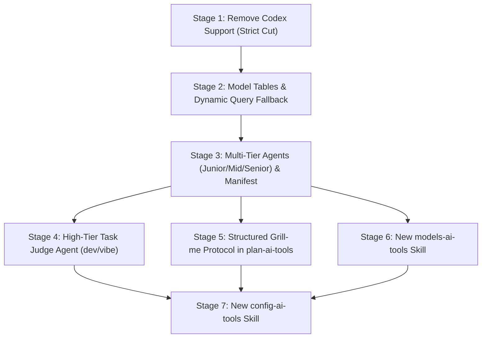

# Base Plan: ai-tools-evolution

## Status table

| Stage | Status | Executor |
|---|---|---|
| 1 | F | implementer |
| 2 | F | implementer |
| 3 | F | implementer |
| 4 | F | implementer |
| 5 | F | implementer |
| 6 | F | implementer |
| 7 | | |

## Goal

Execute a comprehensive architectural evolution of the `ai-tools` ecosystem across 7 core initiatives:
1. Strict removal of OpenAI Codex harness support and cleanup across the repository.
2. Static supported models tables and dynamic CLI query fallback in surviving CLI harness skills (`agy`, `claude`, `copilot`).
3. Standardized 3-tier agent classification (`junior`, `mid`, `senior`) backed by a repository build-time manifest (`config/agents.json`).
4. Dedicated high-tier judge agent dispatching objective verdicts (`ACCEPT` / `REWORK`) in task and plan execution workflows (`dev-ai-tools` and `vibe-ai-tools`).
5. Inquisitive, structured "Grill-me" design interview protocol in `plan-ai-tools` prior to plan writing.
6. New interactive `models-ai-tools` skill to configure preferred models per harness and tier in `$HOME/.ai-tools/config.local.json`.
7. New interactive `config-ai-tools` skill to manage global behavioral preferences (routing gate offers, CLI/model prompts) with zero-latency compiled instructions.

## Base branch

`master`

## Execution graph

## Stages index

1. [`1-ai-tools-evolution.md`](file:///home/wsl/.ai-tools/plans/ai-tools-evolution/1-ai-tools-evolution.md): Strict removal of OpenAI Codex harness support across the entire codebase.
2. [`2-ai-tools-evolution.md`](file:///home/wsl/.ai-tools/plans/ai-tools-evolution/2-ai-tools-evolution.md): Upfront supported model tables and dynamic CLI query fallback in `agy`, `claude`, and `copilot`.
3. [`3-ai-tools-evolution.md`](file:///home/wsl/.ai-tools/plans/ai-tools-evolution/3-ai-tools-evolution.md): Multi-tier agent classification (`junior`, `mid`, `senior`) and centralized repository build manifest (`config/agents.json`).
4. [`4-ai-tools-evolution.md`](file:///home/wsl/.ai-tools/plans/ai-tools-evolution/4-ai-tools-evolution.md): High-tier judge agent dispatch and objective verdict loop (`ACCEPT`/`REWORK`) in `dev-ai-tools` and `vibe-ai-tools`.
5. [`5-ai-tools-evolution.md`](file:///home/wsl/.ai-tools/plans/ai-tools-evolution/5-ai-tools-evolution.md): Inquisitive, structured "Grill-me" design interview protocol in `plan-ai-tools`.
6. [`6-ai-tools-evolution.md`](file:///home/wsl/.ai-tools/plans/ai-tools-evolution/6-ai-tools-evolution.md): Interactive `models-ai-tools` skill for local model preferences in `$HOME/.ai-tools/config.local.json`.
7. [`7-ai-tools-evolution.md`](file:///home/wsl/.ai-tools/plans/ai-tools-evolution/7-ai-tools-evolution.md): Interactive `config-ai-tools` skill for global behavioral customization and instruction synchronization.

## Open questions and risks

- **Instruction Size Budget**: `USER-AGENTS.md` is strictly capped at 8,000 characters (rule 3). Current length is ~7,782 characters. Removing Codex frees characters, but additions for agent tiers and gate preferences must remain within the strict budget.
- **Frontmatter Length Budget**: Every skill description must remain at or below 500 characters (rule 6).
- **Linter Parity**: Any new XML tag must be registered in the Semantic XML grammar table in `README.md` and `scripts/lint.sh` `XML_VOCAB` in the same commit.
- **Git Reset Protection**: `$HOME/.ai-tools/config.local.json` must be added to `.gitignore` so `update.sh`'s `git reset --hard origin/master` does not destroy user preferences or block resets.
