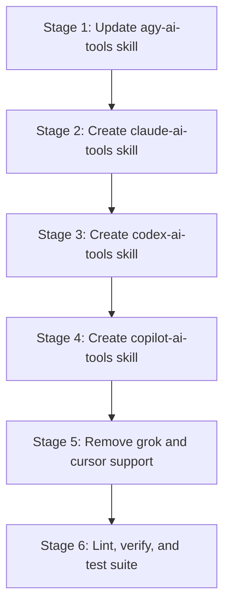

# Base Plan: harness-cli-subagents

## Status table
| Stage | Status | Executor |
| --- | --- | --- |
| 1-harness-cli-subagents.md | F | implementer Gemini 3.8 Flash (High) |
| 2-harness-cli-subagents.md | F | implementer Gemini 3.8 Flash (High) |
| 3-harness-cli-subagents.md | F | implementer Gemini 3.8 Flash (High) |
| 4-harness-cli-subagents.md | F | implementer Gemini 3.8 Flash (High) |
| 5-harness-cli-subagents.md | F | implementer Gemini 3.8 Flash (High) |
| 6-harness-cli-subagents.md | F | implementer Gemini 3.8 Flash (High) |

## Goal
Restructure `ai-tools` to support CLI-based subagent dispatch for exactly four harnesses (`agy`, `claude`, `codex`, `copilot`), create dedicated `*-ai-tools` skills for each with model and reasoning effort control, and remove support for unlisted harnesses (`grok`, `cursor`).

## Base branch
master

## Execution graph

## Stages index
- [1-harness-cli-subagents.md](file:///home/wsl/.ai-tools/plans/harness-cli-subagents/1-harness-cli-subagents.md): Update `agy-ai-tools` skill with an agnostic description focusing on dispatching subagents to the Antigravity CLI (`agy`).
- [2-harness-cli-subagents.md](file:///home/wsl/.ai-tools/plans/harness-cli-subagents/2-harness-cli-subagents.md): Create `claude-ai-tools` skill for dispatching subagents through the Claude Code CLI (`claude`).
- [3-harness-cli-subagents.md](file:///home/wsl/.ai-tools/plans/harness-cli-subagents/3-harness-cli-subagents.md): Create `codex-ai-tools` skill for dispatching subagents through OpenAI Codex CLI (`codex`).
- [4-harness-cli-subagents.md](file:///home/wsl/.ai-tools/plans/harness-cli-subagents/4-harness-cli-subagents.md): Create `copilot-ai-tools` skill for dispatching subagents through GitHub Copilot CLI (`copilot`).
- [5-harness-cli-subagents.md](file:///home/wsl/.ai-tools/plans/harness-cli-subagents/5-harness-cli-subagents.md): Remove Grok and Cursor support from `USER-AGENTS.md`, `README.md`, `scripts/shell/lib.sh`, and test files.
- [6-harness-cli-subagents.md](file:///home/wsl/.ai-tools/plans/harness-cli-subagents/6-harness-cli-subagents.md): Run lint and test suites (`./scripts/lint.sh`, `./scripts/test.sh`) to ensure strict repository compliance.

## Open questions and risks
- None identified. All 4 CLIs have been probed on the host WSL system and verified to support non-interactive execution with model and effort tier parameters.
